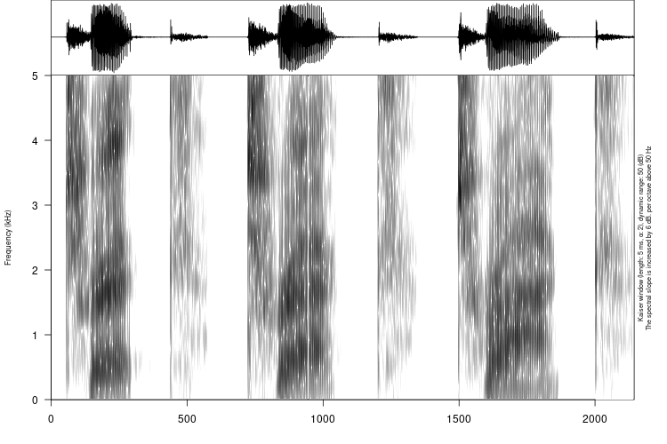
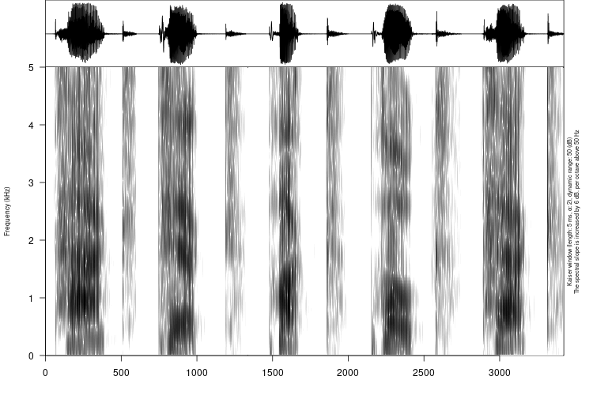
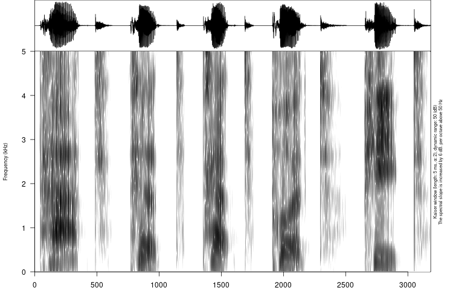

```{r setup08, include=FALSE}
options(digits = 3)
knitr::opts_chunk$set(echo = FALSE, warning = FALSE, message = FALSE, out.width="100%", fig.show='hold', fig.align='center')
library(knitr)
library(tidyverse)
theme_set(theme_bw()+theme(text = element_text(size=18)))
library(checkdown)
```

# Spectrum analysis


## Vowels

###

```{r}
include_graphics("sounds/for_practice/merged/1_bag_big.png")
```

```{r, results='asis'}
my_var <- c("bag", "big")
expand.grid(my_var, my_var) %>% 
  filter(Var1 != Var2) %>% 
  summarise(res = str_c(Var1, ', ', Var2)) %>% 
  pull(res) %>% 
  sample() %>% 
  check_question(str_c(my_var, collapse = ", "), options = ., type = "radio") 
```

### 

```{r}
include_graphics("sounds/for_practice/merged/2_fraction_friction.png")
```

```{r, results='asis'}
my_var <- c("fraction", "friction")
expand.grid(my_var, my_var) %>% 
  filter(Var1 != Var2) %>% 
  summarise(res = str_c(Var1, ', ', Var2)) %>% 
  pull(res) %>% 
  sample() %>% 
  check_question(str_c(my_var, collapse = ", "), options = ., type = "radio") 
```

### 

```{r}
include_graphics("sounds/for_practice/merged/3_men_man.png")
```

```{r, results='asis'}
my_var <- c("men", "man")
expand.grid(my_var, my_var) %>% 
  filter(Var1 != Var2) %>% 
  summarise(res = str_c(Var1, ', ', Var2)) %>% 
  pull(res) %>% 
  sample() %>% 
  check_question(str_c(my_var, collapse = ", "), options = ., type = "radio")  
```

### 

```{r}
include_graphics("sounds/for_practice/merged/4_Rick_rook_wrek.png")
```

```{r, results='asis'}
my_var <- c("Rick", "rook", "wrek")
expand.grid(my_var, my_var, my_var) %>% 
  filter(Var1 != Var2, Var1 != Var3, Var2 != Var3) %>% 
  summarise(res = str_c(Var1, ', ', Var2, ', ', Var3)) %>% 
  pull(res) %>% 
  sample() %>% 
  check_question(str_c(my_var, collapse = ", "), options = ., type = "radio")  
```

###

```{r}
include_graphics("sounds/for_practice/merged/5_neck_nook_Nick.png")
```

```{r, results='asis'}
my_var <- c("neck", "nook", "Nick")
expand.grid(my_var, my_var, my_var) %>% 
  filter(Var1 != Var2, Var1 != Var3, Var2 != Var3) %>% 
  summarise(res = str_c(Var1, ', ', Var2, ', ', Var3)) %>% 
  pull(res) %>% 
  sample() %>% 
  check_question(str_c(my_var, collapse = ", "), options = ., type = "radio")  
```

###

```{r}
include_graphics("sounds/for_practice/merged/6_book_beck_back.png")
```

```{r, results='asis'}
my_var <- c("book", "beck", "back")
expand.grid(my_var, my_var, my_var) %>% 
  filter(Var1 != Var2, Var1 != Var3, Var2 != Var3) %>% 
  summarise(res = str_c(Var1, ', ', Var2, ', ', Var3)) %>% 
  pull(res) %>% 
  sample() %>% 
  check_question(str_c(my_var, collapse = ", "), options = ., type = "radio")  
```

###

```{r}
include_graphics("sounds/for_practice/merged/7_hick_hack_hook.png")
```

```{r, results='asis'}
my_var <- c("hick", "hack", "hook")
expand.grid(my_var, my_var, my_var) %>% 
  filter(Var1 != Var2, Var1 != Var3, Var2 != Var3) %>% 
  summarise(res = str_c(Var1, ', ', Var2, ', ', Var3)) %>% 
  pull(res) %>% 
  sample() %>% 
  check_question(str_c(my_var, collapse = ", "), options = ., type = "radio")  
```

###

```{r}
include_graphics("sounds/for_practice/merged/8_mood_mid_mad.png")
```

```{r, results='asis'}
my_var <- c("mood", "mid", "mad")
expand.grid(my_var, my_var, my_var) %>% 
  filter(Var1 != Var2, Var1 != Var3, Var2 != Var3) %>% 
  summarise(res = str_c(Var1, ', ', Var2, ', ', Var3)) %>% 
  pull(res) %>% 
  sample() %>% 
  check_question(str_c(my_var, collapse = ", "), options = ., type = "radio")  
```

###

```{r}

```

```{r, results='asis'}
my_var <- c("trick", "trek", "track")
expand.grid(my_var, my_var, my_var) %>% 
  filter(Var1 != Var2, Var1 != Var3, Var2 != Var3) %>% 
  summarise(res = str_c(Var1, ', ', Var2, ', ', Var3)) %>% 
  pull(res) %>% 
  sample() %>% 
  check_question(str_c(my_var, collapse = ", "), options = ., type = "radio")  
```

###

```{r}
include_graphics("sounds/for_practice/merged/10_dam_dim_deem_doom.png")
```

```{r, results='asis'}
my_var <- c("dam", "dim", "deem", "doom")
expand.grid(my_var, my_var, my_var, my_var) %>% 
  filter(Var1 != Var2, Var1 != Var3, Var1 != Var4, Var2 != Var3, Var2 != Var4, Var3 != Var4) %>% 
  summarise(res = str_c(Var1, ', ', Var2, ', ', Var3, ', ', Var4)) %>% 
  pull(res) %>% 
  sample() %>% 
  check_question(str_c(my_var, collapse = ", "), options = ., type = "radio")  
```

###

```{r}
include_graphics("sounds/for_practice/merged/11_foot_feat_fat_fit.png")
```

```{r, results='asis'}
my_var <- c("foot", "feat", "fat", "fit")
expand.grid(my_var, my_var, my_var, my_var) %>% 
  filter(Var1 != Var2, Var1 != Var3, Var1 != Var4, Var2 != Var3, Var2 != Var4, Var3 != Var4) %>% 
  summarise(res = str_c(Var1, ', ', Var2, ', ', Var3, ', ', Var4)) %>% 
  pull(res) %>% 
  sample() %>% 
  check_question(str_c(my_var, collapse = ", "), options = ., type = "radio")  
```

###

```{r}
include_graphics("sounds/for_practice/merged/12_moose_mess_mass_miss.png")
```

```{r, results='asis'}
my_var <- c("moose", "mess", "mass", "miss")
expand.grid(my_var, my_var, my_var, my_var) %>% 
  filter(Var1 != Var2, Var1 != Var3, Var1 != Var4, Var2 != Var3, Var2 != Var4, Var3 != Var4) %>% 
  summarise(res = str_c(Var1, ', ', Var2, ', ', Var3, ', ', Var4)) %>% 
  pull(res) %>% 
  sample() %>% 
  check_question(str_c(my_var, collapse = ", "), options = ., type = "radio")  
```

###

```{r}

```

```{r, results='asis'}
my_var <- c("net", "nut", "knit", "knot")
expand.grid(my_var, my_var, my_var, my_var) %>% 
  filter(Var1 != Var2, Var1 != Var3, Var1 != Var4, Var2 != Var3, Var2 != Var4, Var3 != Var4) %>% 
  summarise(res = str_c(Var1, ', ', Var2, ', ', Var3, ', ', Var4)) %>% 
  pull(res) %>% 
  sample() %>% 
  check_question(str_c(my_var, collapse = ", "), options = ., type = "radio")  
```

###

```{r}
include_graphics("sounds/for_practice/merged/14_roast_wrist_roost_rest.png")
```


```{r, results='asis'}
my_var <- c("roast", "wrist", "roost", "rest")
expand.grid(my_var, my_var, my_var, my_var) %>% 
  filter(Var1 != Var2, Var1 != Var3, Var1 != Var4, Var2 != Var3, Var2 != Var4, Var3 != Var4) %>% 
  summarise(res = str_c(Var1, ', ', Var2, ', ', Var3, ', ', Var4)) %>% 
  pull(res) %>% 
  sample() %>% 
  check_question(str_c(my_var, collapse = ", "), options = ., type = "radio")  
```

###

```{r}
include_graphics("sounds/for_practice/merged/15_skin_skim_scam_scan.png")
```

```{r, results='asis'}
my_var <- c("skin", "skim", "scam", "scan")
expand.grid(my_var, my_var, my_var, my_var) %>% 
  filter(Var1 != Var2, Var1 != Var3, Var1 != Var4, Var2 != Var3, Var2 != Var4, Var3 != Var4) %>% 
  summarise(res = str_c(Var1, ', ', Var2, ', ', Var3, ', ', Var4)) %>% 
  pull(res) %>% 
  sample() %>% 
  check_question(str_c(my_var, collapse = ", "), options = ., type = "radio")  
```

###

```{r}
include_graphics("sounds/for_practice/merged/16_bit_bat_boot_bet_bot.png")
```

```{r, results='asis'}
my_var <- c("bit", "bat", "boot", "bet", "bot")
expand.grid(my_var, my_var, my_var, my_var, my_var) %>% 
  filter(Var1 != Var2, Var1 != Var3, Var1 != Var4, Var1 != Var5, Var2 != Var3, Var2 != Var4, Var2 != Var5, Var3 != Var4, Var3 != Var5, Var4 != Var5) %>% 
  summarise(res = str_c(Var1, ', ', Var2, ', ', Var3, ', ', Var4, ', ', Var5)) %>% 
  pull(res) %>% 
  sample() %>% 
  check_question(str_c(my_var, collapse = ", "), options = ., type = "radio")  
```

###

```{r}

```

```{r, results='asis'}
my_var <- c("pack", "pick", "puck", "poke", "peck")
expand.grid(my_var, my_var, my_var, my_var, my_var) %>% 
  filter(Var1 != Var2, Var1 != Var3, Var1 != Var4, Var1 != Var5, Var2 != Var3, Var2 != Var4, Var2 != Var5, Var3 != Var4, Var3 != Var5, Var4 != Var5) %>% 
  summarise(res = str_c(Var1, ', ', Var2, ', ', Var3, ', ', Var4, ', ', Var5)) %>% 
  pull(res) %>% 
  sample() %>% 
  check_question(str_c(my_var, collapse = ", "), options = ., type = "radio")  
```


###

```{r}

```

```{r, results='asis'}
my_var <- c("pat", "pit", "pet", "put", "peat")
expand.grid(my_var, my_var, my_var, my_var, my_var) %>% 
  filter(Var1 != Var2, Var1 != Var3, Var1 != Var4, Var1 != Var5, Var2 != Var3, Var2 != Var4, Var2 != Var5, Var3 != Var4, Var3 != Var5, Var4 != Var5) %>% 
  summarise(res = str_c(Var1, ', ', Var2, ', ', Var3, ', ', Var4, ', ', Var5)) %>% 
  pull(res) %>% 
  sample() %>% 
  check_question(str_c(my_var, collapse = ", "), options = ., type = "radio")  
```

###

```{r}
include_graphics("sounds/for_practice/merged/19_ring_wrong_rank_rink_rang.png")
```

```{r, results='asis'}
my_var <- c("ring", "wrong", "rank", "rink", "rang")
expand.grid(my_var, my_var, my_var, my_var, my_var) %>% 
  filter(Var1 != Var2, Var1 != Var3, Var1 != Var4, Var1 != Var5, Var2 != Var3, Var2 != Var4, Var2 != Var5, Var3 != Var4, Var3 != Var5, Var4 != Var5) %>% 
  summarise(res = str_c(Var1, ', ', Var2, ', ', Var3, ', ', Var4, ', ', Var5)) %>% 
  pull(res) %>% 
  sample() %>% 
  check_question(str_c(my_var, collapse = ", "), options = ., type = "radio")  
```

